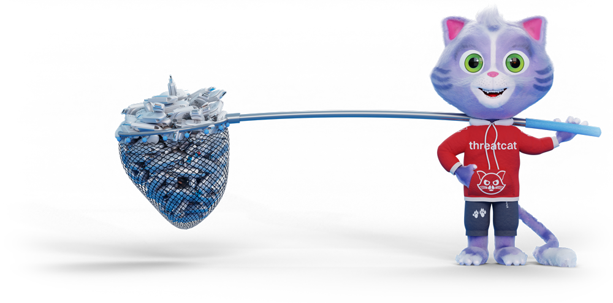

# About ThreatCat.ch

ThreatCat.ch has been founded in the autumn 2022 and consists of a bunch of experienced Cyber Threat Analysts and 
Incident Responders who have been working together for many years. We decided to create ThreatCat.ch to be able to 
serve the community by providing warnings and insights about emerging cyber threats. Occasionally we may also write 
about tools and tricks we have learned in our daily work life. And of course, ThreatCat.ch is about having fun doing 
interesting stuff together.  

Currently we are publishing information on [our website](https://www.threatcat.ch), on [Mastodon](https://infosec.exchange/@threatcat_ch), Bluesky (@threatcat-ch.bsky.social) and [Twitter](https://twitter.com/threatcat_ch). All our information is distributed under Creative Commons CC BY 4.0 and all our opinions is ours and not that of our employers. You can always reach out to us via hello@threatcat.ch. 

